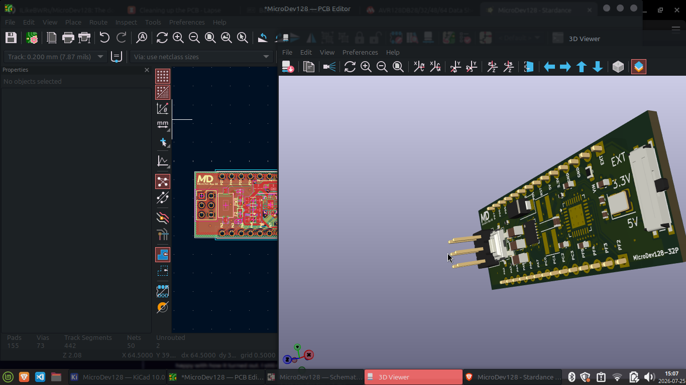

# MicroDev128-32P
## A high-power development/prototyping board with MVIO. 
Based on the AVR128DB32. 

The MicroDev128-32P is open-source development board with a high-power voltage regulator with up to 2A continous, Multi-voltage IO - which allows PortC to run on a different voltage than the rest of the board - elimenating the need for voltage level shifters. 

**Key Specifications:**
- Up to 2A continuos on both power lines, 3.3v and 5v with up to 42VDC input
- Arduino Nano sized footprint, allowing it to easily be plugged into breadboards
- 128kB Flash, 16kB SRAM, and 512B EEPROM
- External clock speed of 16MHz with internal clock adjustable up to 24MHz max
- Built in TVS and 5A fuse
- UPDI Header for easy programing

## Vision
To make a development board with more features, better power delivery and better price to performance than a Geniune Arduino Nano, but keep it the same size. 
