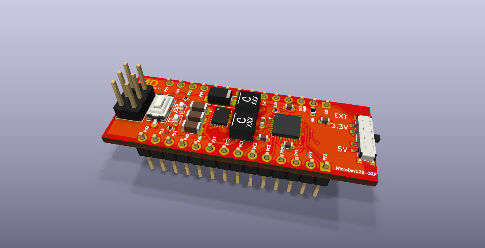
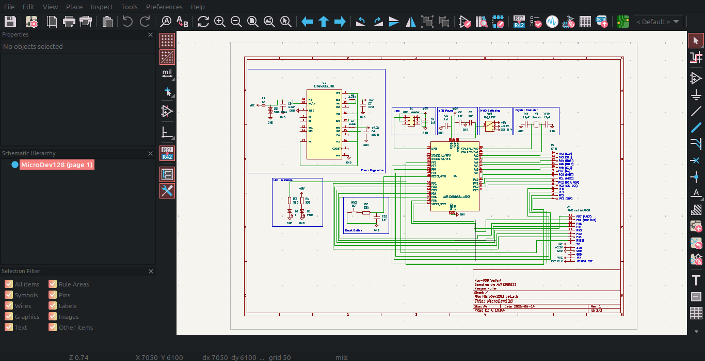
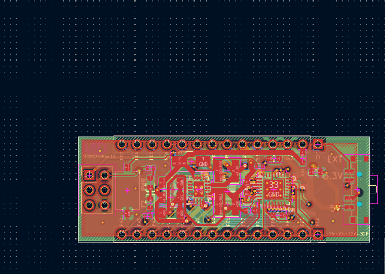

# MicroDev128-32P
## A high-power development/prototyping board with MVIO. 
Based on the AVR128DB32. 

The MicroDev128-32P is open-source development board with a high-power voltage regulator with up to 2A continous, Multi-voltage IO - which allows PortC to run on a different voltage than the rest of the board - elimenating the need for voltage level shifters. 

**Key Specifications:**
- Up to 2A continuos on both power lines, 3.3v and 5v with up to 42VDC input
- Arduino Nano sized footprint, allowing it to easily be plugged into breadboards
- 128kB Flash, 16kB SRAM, and 512B EEPROM
- External clock speed of 16MHz with internal clock adjustable up to 24MHz max
- Built in TVS and 5A fuse
- UPDI Header for easy programing

## Vision
To make a development board with more features, better power delivery and better price to performance than a Geniune Arduino Nano, but keep it the same size. 

## Next Steps
I now need to get PCBs made, and do testing to make sure the power lines are clean and find any errors with the board. 

## Datasheets

AVR128DB32 Datasheet -[Here](https://ww1.microchip.com/downloads/en/DeviceDoc/AVR128DB28-32-48-64-DataSheet-DS40002247A.pdf) 

LT8653S Datasheet -[Here](https://www.analog.com/media/en/technical-documentation/data-sheets/lt8653s.pdf)

## Images

## Schematics 

To view the Schematics you can go into the Kicad files folder. All files were made on KiCad 10.04 and should import without other dependencies. 

## *⚠️ Hardware is currently untested: Order at you own risk!*

To order your own you have a few ways:

**1. Order PCBs and assemble them yourselfs**

*You will need a hotplate for solder reflow and solder paste. May be cheaper but harder to do!*

Upload the Gebers at:
/Production Files
   /Gebers.zip
Go to your favorite PCB manufacturer and upload the gebers. Make sure it says 4-layers. Set it to ENIG, and set the solder mask to any colour you want. The default settings will be fine.

Next in the same folder find the BOM.csv and order the parts from your favorite part distributor. 
To lay out components once they turn up you can use the KiCad PCB layout. A dedicated image for this step will come later.

**2. Use a PCBA service and get them shipped assembled**

Upload the Gebers at:
/Production Files
   /Gebers.zip
Go to your favorite PCB manufacturer and upload the gebers. Make sure it says 4-layers. Set it to ENIG, and set the solder mask to any colour you want. The default settings will be fine.
Then upload the BOM.csv and CPL.csv to the page. Then check if they in stock. (You may need to pre-order some parts!)
The check component orientation - it has a tendency to flip the LT8653S by 90 degrees. 

## For more check out my stardance project page: -[Stardance Hackclub](https://stardance.hackclub.com/projects/6131)
